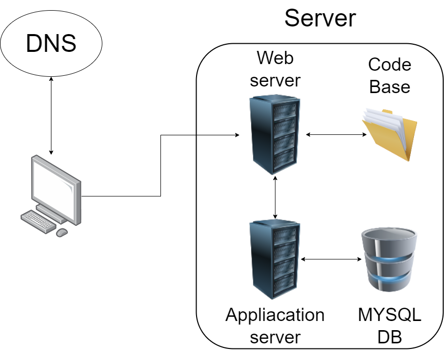

# DNS

Whenever you enter a website domain name into your web browser the web browser first has to convert the domain name into an IP address (Internet Protocol address), this is done with the help of DNS (Domain Name System).

DNS or Domain Name System is charged with converting the domain that a user enters into the web browser into the IP address that identifies the particular resource that the user is looking for
When you type the domain name in your web browser, the web browser will first check its cache to see if it has the IP address stored. If the IP address isn't found,
the web browser will then ask the OS (Operating System) if it has the IP address stored, if the OS doesn't have the address stored, it will call upon the resolver to help.

The resolver is usually the ISP server (Internet Service Provider), its main purpose is to know the location of the root server, once invoked the
resolver will request from the IP address from the root server, if the root server does not have the IP address stored it will redirect the resolver to the .com TLD server (Top Level Domain server).

the TLD server will then direct the resolver to the relevant name server that has the IP address that is associated with the domain name. The resolver then grabs the IP address and on its way back to the web browser it ensures that the IP address is stored in the root server, the OS and the web browser's cache.

The web browser then makes an HTTP request to the relevant web server.

# SERVER

A sever can either be a physical or virtual device that is used to store resources that are typically requested by users. Servers usually have their own operating system and may be made up of many other virtual servers.

# WEB SERVER

The web server is charged with accepting and processing HTTP requests. Depending on the request the webserver may return a static web page to the user together with other requested resources.

HTTP (Hyper Text Transfer Protocol) refers to the rules that govern the flow to data between the server and clients, the client typically sends an HTTP request to the server and receives back an HTTP response.

# CODE BASE

the code base holds all html web pages and other resources such as images and videos and is what the web server typically accesses to send information back to the web browser.

# Application Server

The application server holds business logic and is used in situations where the user may not require a html page as a response, an example of this is in the case of a super market where a cashier may only need to know the price of one item in store.

# MYSQL database

A database is a collection of data that is stored in an organized and structural manner, usually in rows and columns.

MYSQL is a Database Management System (DBMS) that is used to access said data. The web server usually accesses this data with the help of a server side language such as with PHP or Perl, this information is then added to dynamic web pages and returned back to the user.
