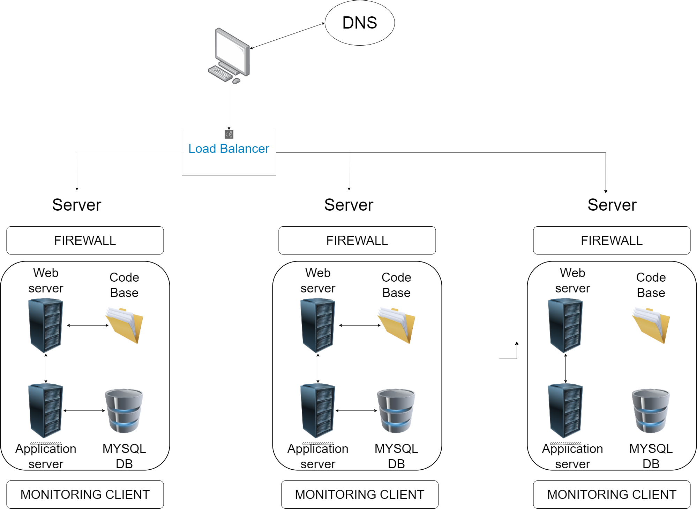

# FIREWALLS

The firewalls help to improve data security by controlling what IP addresses have access to the severs and blocking any unauthorized IP address from accessing the servers.

# SSL certificate

The SSL certificate is issued to the web browser and it contains a public encryption and decryption key that is used to decrypt data sent by the sever to the web browser and encrypt data sent from the web browser to the server. This ensures that data is secure and cannot be intercepted on transit.

# monitoring clients

The monitoring clients are used to monitor the performance of the system and report on the status of the system. This helps network administrators make the necessary changes to improve the network or avoid downtime that can be harmful to the organization.

